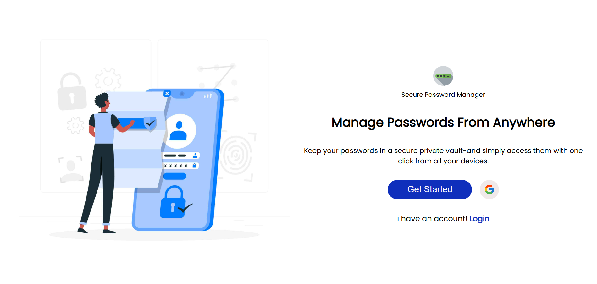
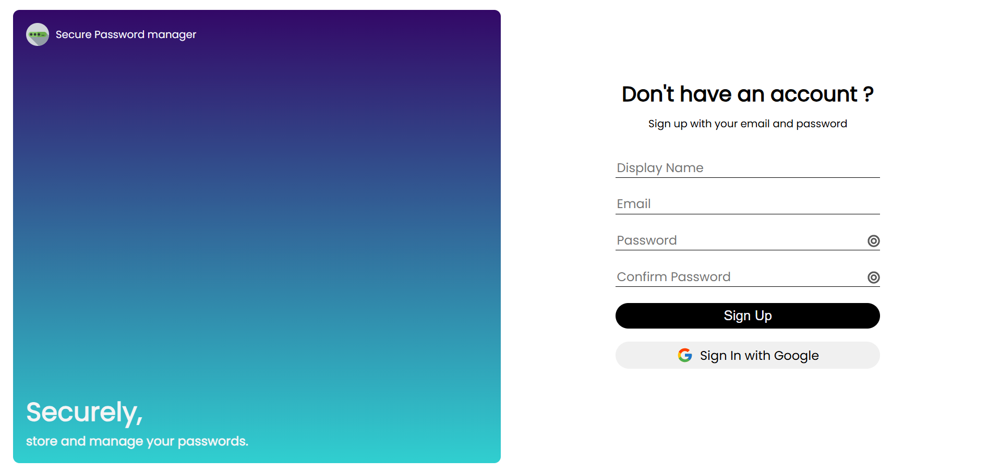
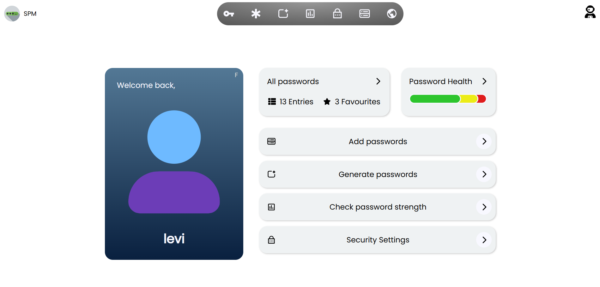

# Secure Password Manager

A modern, zero-knowledge, client-side encrypted password manager that prioritizes your privacy and security. Built with cutting-edge encryption practices and a sleek PWA-ready interface.

> "You own your keys. You control your data."

---

## Features

-  **Master Password Based Encryption**  
  Your vault is protected by a master password that never leaves your device.

-  **AES-256 Encryption**  
  Passwords are individually encrypted using the trusted AES-256 algorithm.

-  **PBKDF2 Key Derivation**  
Keys are derived using PBKDF2 with 125,000+ iterations and a unique salt per password.

-  **Zero-Knowledge Architecture**  
  We never store or see your master password or derived keys.

-  **Auto Timeout and Vault Lock**  
 Auto-locks your vault after 7 minutes of inactivity to prevent unauthorized access.

-  **Progressive Web App (PWA)**  
  Installable on mobile/desktop, fast startup, native feel.

---

##  How It Works: Security Workflow

| Step | Description |
|------|-------------|
| **1. Master Password Creation** | Your master password is never stored. It’s used only to derive your unique encryption key. Use a strong passphrase with 10+ characters. |
| **2. Key Derivation** | We use **PBKDF2** (125k+ iterations) to derive an encryption key in an isolated **Web Worker**. Unique salt for each password ensures no repetition. |
| **3. Password Encryption** | Every password is independently encrypted using **AES-256** — even if one gets compromised, others remain secure. |
| **4. Secure Storage** | We store **only encrypted data** along with unique salts. Without your master password, data is useless. |
| **5. Password Retrieval** | When needed, your key is re-derived to decrypt a password — done temporarily in memory and wiped instantly after. |
| **6. Security Timeouts** | The derived key expires after **7 minutes** of inactivity. You can also manually lock your vault. |
| **7. Zero-Knowledge** | Encryption/decryption happens entirely **on your device**. No data or keys are transmitted or stored by us. |

---

##  Real-World Impact & Security

- **Zero data breaches:** No central server ever stores decryptable user data.
- **Protection from insider attacks:** Even app developers cannot access user vaults.
- **Independent encryption:** Unlike typical managers, each password is encrypted with unique salt + key combination.
- **User-controlled lifecycle:** Session-bound encryption key is automatically erased..

This structure offers **parity with top-tier commercial password managers**, but is executed entirely on the client — perfect for both privacy activists and developers.

---

##  Tech Stack

**Frontend:**
- `React 18`
- `SASS` for styling
- `PWA` support
- `animate.css` for UI transitions
- `boring-avatars` for password profiles
- `zxcvbn` for password strength estimation
- `react-icons`, `react-router-dom`

**Security & Utilities:**
- `bcryptjs` for optional hash validations
- `PBKDF2` for key derivation (Web Crypto API)
- `AES-256` encryption (Web Crypto API)
- `Web Worker` for secure, non-blocking key derivation

**Backend & Auth:**
- `Firebase` for real-time database and authentication

**PWA Capabilities:**
- Installable across platforms (desktop/mobile)
- Background process optimizations
- Instant load experience
- Safe for multi-tab browsing and private sessions

---

## Developer Notes
- All encryption logic is modular and handled on the frontend using isolated Web Crypto API calls..
- Web Worker securely isolates cryptographic operations.
- All cryptographic logic and vault protection runs entirely on the frontend.
- Designed for readability, security, and extendability.

## Future Enhancements
- Biometric authentication support (WebAuthn)
- Secure vault export/import
- Password Breach alerts
- Backup encrypted vault to personal cloud storage

## Screenshots
###  Welcome Page

###  Sign Up Page

### Dashboard View

## Repository Info
>  Note: This repository contains only the build output (/dist) used for deployment (Netlify).
The full source code and development files are maintained in a private repository.
This repo is automatically updated with the latest production build via CI/CD (GitHub Actions).

---

### Live 

[Try the App on Netlify](https://spm-lite.netlify.app)  
_Deployed and production-ready. Works best on desktop or PWA-supported mobile browsers._

---

## Author
#### V Vishwaradhya
[GitHub](http://github.com/vishwa-radhya/)

